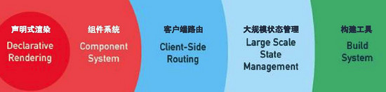

# lesson1
##基础
###vue.js介绍

vue被称为*渐进式框架*，怎么个渐进式如下图



就是说最初可以使用vue中的一些功能来简化dom操作，觉的熟练了，进一步使用组件化提高代码复用性，再到路由的使用，然后是vuex...等等，
就是说我们可以循序渐进的使用它，这样可以降低学习和使用的成本，并体现这个框架足够灵活和轻量。
其他见官网

###基础概念

1. 声明式渲染

   就是按vue的规矩写，vue去帮你渲染，具体vue怎么做的不需要你管。让vue的使用者更能去关心要做什么，而不是怎么做。

```html
    <div id="app">
        <!--通过模板，使foo被data中的foo的值替代（其实是app.foo的值）-->
        {{foo}}
    </div>
    <script>
        //new一个vue实例
        var app=new Vue({
            //找到vue实例要挂载的dom元素
            el:"#app",
            data:{
               foo:"hello world!"
            }
        })
    </script>
```

2. 双向数据绑定
数据绑定，就是页面dom元素与vue实例中的数据进行绑定，也会称之为*响应式数据*
下面这个例子，我们通过对app这个实例里面的数据进行修改，进而修改了页面上的dom元素。
```html
    <div id="app">
        {{foo.name}}
    </div>
    <script>
        var bar={name:"nigel"}
        var app=new Vue({
            el:"#app",
            data:{
               foo:bar,
               baz:"ooo"
            }
        })
        //1.输出为ooo，vue的实例会代理data对象里面的数据
        console.log(app.baz);
        //2.输出为ooo，通过$data访问data属性
        console.log(app.$data.baz);
        //3.app.foo.name被修改，页面也被修改
        app.foo.name="xxx"
        //4.输出为xxx，说明vue实例代理data对象里面的数据不是深拷贝ß
        console.log(bar.name);
    </script>
```   

双向数据绑定,input输入框里面的值变化了会导致app.foo的值变化，app.foo的值变化了也引起了p标签中文本的变化，这就是一个从页面到数据对象和数据对象到页面的双向的数据绑定。

```html
<div id="app">
        <input type="text" v-model="foo">
        <p>{{foo}}</p>
    </div>
    <script>
        var app=new Vue({
            el:"#app",
            data:{
               foo:"bar"
            }
        })
    </script>
```

3. mvvm


这里我们可以把vue的实例看做是vm，vue就是通过vm（vue实例）与v层（页面的dom）进行绑定，达到尽量少操作dom的目的。

 